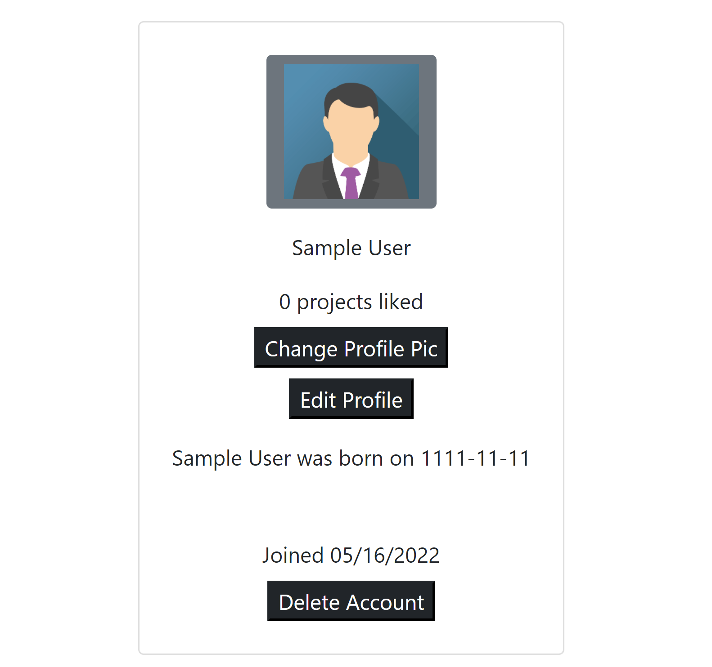

# Web Development Course Project: Resume Site

### What is this supposed to be?

This is my course project for Web Development! The task was to create a full stack web application of our choosing, so long as it met some minimum requirements, mainly pertaining to client-server interactions. I chose a resume site for myself, which also hosts projects.

The idea for the site is that users can signup/login and like/comment different projects, and filter them with certain tags.

### What is it actually? What is missing?

Currently users can signup/login, edit their profile (username, password, and profile picture), and at the moment can create projects (though this is ideally meant to be accessible only to admins). Liking and commenting are not implemented, though the backend support is there, nor can projects be filtered by tag. Also ==password are not hashed==, though since this app currently can only be run locally it is not a problem.

## Technologies Used

### Front-end

- [Bootstrap](https://getbootstrap.com/)
- [Font Awesome](https://fontawesome.com/)

### Back-end

- [Node.js](https://nodejs.org/)
- [Express.js](https://expressjs.com/)
- [nodemon](https://www.npmjs.com/package/nodemon)
- [MySQL](https://www.mysql.com/)

## Entity Relationships


### Users Table

Contains all the user data taken on sign-up, where userId is the primary key.

| Column    | Type         |
|-----------|--------------|
| userId    | INT          |
| userName  | VARCHAR(255) |
| userEmail | VARCHAR(255) |
| password  | VARCHAR(255) |
| birthdate | VARCHAR(255) |
| isAdmin   | BOOLEAN      |

#### Business Rules
User creates one Profile
User may create many Projects
User may create many Comments

### Profiles Table

This table contains all the profiles, where profileId is the primary key and userId is the foreign key.

| Column         | Type         |
|----------------|--------------|
| profileId      | INT          |
| userId         | INT          |
| dateCreated    | VARCHAR(255) |
| lastLoginDate  | VARCHAR(255) |
| profilePicture | VARCHAR(5000)|

#### Business Rules
Profile is create by one User

### Projects Table

This table contains all of the projects, where profileId is the primary key.

| Column            | Type          |
|-------------------|---------------|
| projectId         | INT           |
| projectName       | VARCHAR(255)  |
| projectGithub     | VARCHAR(255)  |
| projectThumbnail  | VARCHAR(6000) |
| projectText       | VARCHAR(255)  |
| projectLikes      | INT           |
| projectCommentIds | VARCHAR(255)  |
| projectTags       | VARCHAR(255)  |

#### Business Rules
A project is created by one user
A project may contain many comments

### Comments Table

This table contains all the comments on projects, where commentId is the primary key and userID and projectId are foreign keys.

| Column      | Type         |
|-------------|--------------|
| commentId   | INT          |
| commentText | VARCHAR(255) |
| commentDate | VARCHAR(255) |
| userId      | INT          |
| projectId   | INT          |

#### Business Rules
Comment may be created by one User
Comment is contained by one Project
 

## Get Started

To run this web app, you'll need Node.js, npm, git, and MySQL installed.

### General Dependencies
- [Node.js](https://nodejs.org/) (Required) - Backend server
- [npm](https://www.npmjs.com/) (Required) - Package manager
- [git](https://git-scm.com/) (Required) - Version control
- [MySQL](https://www.mysql.com/) (Required) - Database

### Cloning
To clone the repository, run the following command in your terminal from the directory you want the project to be saved:
```sh
git clone github.com/Frank-Seelmann/Web-Development-Course-Project
```

### Configuration
To allow the project to create MySQL tables locally, you will need to set the following values in a .env file:
```sh
MYSQL_HOST= most likely localhost
MYSQL_USERNAME= most likely root
MYSQL_PSWD= your MySQL password
MYSQL_DB= the name of the database/schema
```

Run this to install the necessary packages via nodemon.
```sh
npm i
```

To run, execute:
```sh
npm run dev
```

And open [localhost:3000](http://localhost:3000/) in your browser.

## Screenshots

### Signup


### Login


### View Profile


### Create Project


### View Projects


